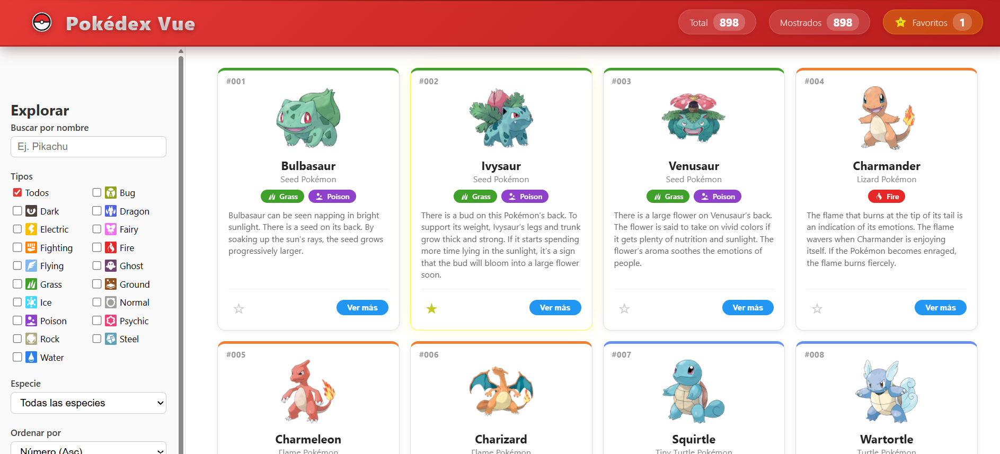

# 🐾 Pokédex Vue 3

Aplicación web interactiva de Pokédex construida con **Vue 3** y **Composition API**, que permite consultar, filtrar y visualizar información de Pokémon desde un archivo JSON, con soporte para favoritos persistente en `localStorage` 

---

## ✨ Características

- **Carga de datos:** Fetch del archivo `pokedex.json` al iniciar, con estados de carga y error.
- **Filtros avanzados:**
  - Búsqueda por nombre (case‑insensitive, trim y búsqueda parcial).
  - Filtro por tipos con checkboxes e íconos SVG (comportamiento adaptado a la Pokédex oficial).
  - Filtro por especie (selector desplegable).
  - Ordenamiento por número (asc/desc) y nombre (A‑Z / Z‑A).
  - Checkbox "Solo favoritos".
  - Botón "Limpiar filtros" que restaura todos los valores iniciales.
- **Favoritos con persistencia:** Guarda los IDs de favoritos en `localStorage` mediante `watch`, y los recupera al cargar la app.
- **Modal de detalle:** Muestra información completa del Pokémon (estadísticas, habilidades, perfil) con cierre por botón, fondo externo y tecla ESC.
- **Diseño responsive:** Adaptado a dispositivos móviles con sidebar colapsable.
- **Resaltado visual:** La carta del Pokémon seleccionado se resalta con borde dorado y sombra.
- **Íconos de tipos:** Los tipos se muestran con sus colores característicos y su respectivo SVG.

---

## 🛠 Tecnologías

- [Vue 3](https://vuejs.org/) 
- [Vite](https://vitejs.dev/) 
- [Composition API](https://vuejs.org/guide/extras/composition-api-faq) 
- JavaScript (ES6+) 
- CSS puro – Estilos scoped y globales, sin librerías externas.

---

## 📁 Estructura del Proyecto

```text
practica-2-pokedex-vue/
├── public/
│   └── data/
│       └── pokedex.json          # Datos de Pokémon
│
├── src/
│   ├── assets/
│   │   └── icons/
│   │       ├── pokebola.svg      # Logo del header
│   │       ├── star.svg          # Ícono de favoritos
│   │       └── types/            # Íconos de tipos
│   │           ├── fire.svg
│   │           ├── water.svg
│   │           ├── grass.svg
│   │           └── ...
│   │
│   ├── components/
│   │   ├── AppHeader.vue         # Header con logo y estadísticas
│   │   ├── PokemonFilters.vue    # Barra lateral de filtros
│   │   ├── PokemonList.vue       # Contenedor del grid de tarjetas
│   │   ├── PokemonCard.vue       # Tarjeta individual de Pokémon
│   │   └── PokemonDetail.vue     # Modal con detalles del Pokémon
│   │
│   ├── App.vue                   # Componente principal (estado global y lógica)
│   └── main.js                   # Punto de entrada de la aplicación
│
├── .gitignore
├── index.html
├── package.json
├── package-lock.json
├── README.md
└── vite.config.js
```
---

## 📸 Vista previa de la página web




---
## 🚀 Instalación y Ejecución

### Requisitos

- Node.js (versión 16 o superior)
- npm (incluido con Node.js)

### Pasos

```bash
# 1. Clonar o descargar el proyecto
git clone https://github.com/tuusuario/practica-2-pokedex-vue.git
cd practica-2-pokedex-vue

# 2. Instalar dependencias
npm install

# 3. Ejecutar en modo desarrollo (con recarga en caliente)
npm run dev

# 4. Compilar para producción (genera carpeta dist/)
npm run build

# 5. Previsualizar la versión compilada
npm run preview